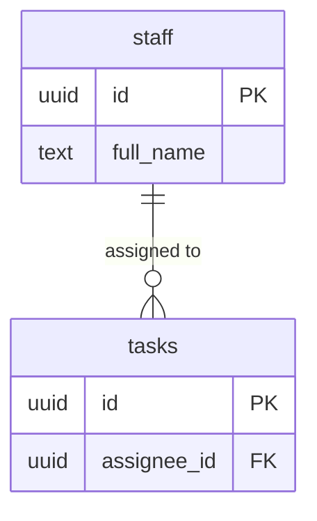

# My Camp — מסמך הגשת פרויקט גמר

מערכת Full-Stack לניהול משלחות קיץ של הסוכנות היהודית בארה"ב — ריכוז נתוני חניכים, עדכונים יומיים וניהול אדמיניסטרטיבי לצוות, מנהלי המשלחת והורים, בפלטפורמה אחת.

## 1. קישור לפרויקט חי

🔗 [https://final-project-may-amoday.vercel.app](https://final-project-may-amoday.vercel.app)

## 2. קישור ל-GitHub (עם README)

🔗 [https://github.com/mayamoday/final-project-may-amoday](https://github.com/mayamoday/final-project-may-amoday)

## 3. תרשים ERD של בסיס הנתונים

תרשים ה-ERD משקף את הטבלאות והקשרים כפי שהם מיושמים בקוד הנוכחי (`src/lib/api.ts`, `src/contexts/AuthContext.tsx`, ועוד).

**Storage Buckets (Supabase Storage):** `camper_profiles`, `receipts`, `documents`, `avatars`

> ⚠️ הערה לתיעוד: בקוד הנוכחי קיימת חוסר אחידות בשמות טבלאות בין יחיד לרבים (למשל `posts`/`post`, `expenses`/`expense`, `documents`/`document`, `incidents`/`events`). מומלץ לאחד את שמות הטבלאות בבסיס הנתונים לפני ההגשה הסופית כדי שהתרשים יתאר במדויק את הסכמה בפועל.

## 4. רשימת שירותים חיצוניים ואינטגרציות

הטבלה משקפת את **המצב האמיתי בפועל** של הקוד הנוכחי, ולא רשימת שירותים מתוכננת.

| שירות | סוג | למה משמש | סטטוס |
| --- | --- | --- | --- |
| Supabase Auth | אוטנטיקציה | הרשמה/התחברות עם אימייל וסיסמה, ניהול session, הפרדת תפקידים (`staff`/`camper`) דרך `user_metadata` | ✅ מיושם (`src/contexts/AuthContext.tsx`) |
| Supabase PostgreSQL | בסיס נתונים | אחסון כל נתוני האפליקציה — חניכים, צוות, פיד, הוצאות, משימות, תקריות, מסמכים | ✅ מיושם (`src/lib/api.ts`) |
| Supabase Storage | אחסון קבצים | העלאת תמונות פרופיל, קבלות הוצאות, מסמכים ותמונות פרופיל אישיות (Buckets: `camper_profiles`, `receipts`, `documents`, `avatars`) | ✅ מיושם |
| Google OAuth | אוטנטיקציה | התחברות דרך חשבון גוגל | ❌ לא מיושם בקוד הנוכחי |
| OpenAI / שירות AI | קריאת API | יצירת טקסט / ניתוח קלט המשתמש | ❌ לא מיושם בקוד הנוכחי |
| Supabase Edge Function | לוגיקת שרת | קריאות מאובטחות ל-API חיצוני | ❌ לא מיושם בקוד הנוכחי |
| Supabase Realtime | Push בזמן אמת | עדכון פיד בזמן אמת בעת תגובה/לייק/אינסידנט | ❌ לא נמצא שימוש ב-`.channel()` בקוד הנוכחי |
